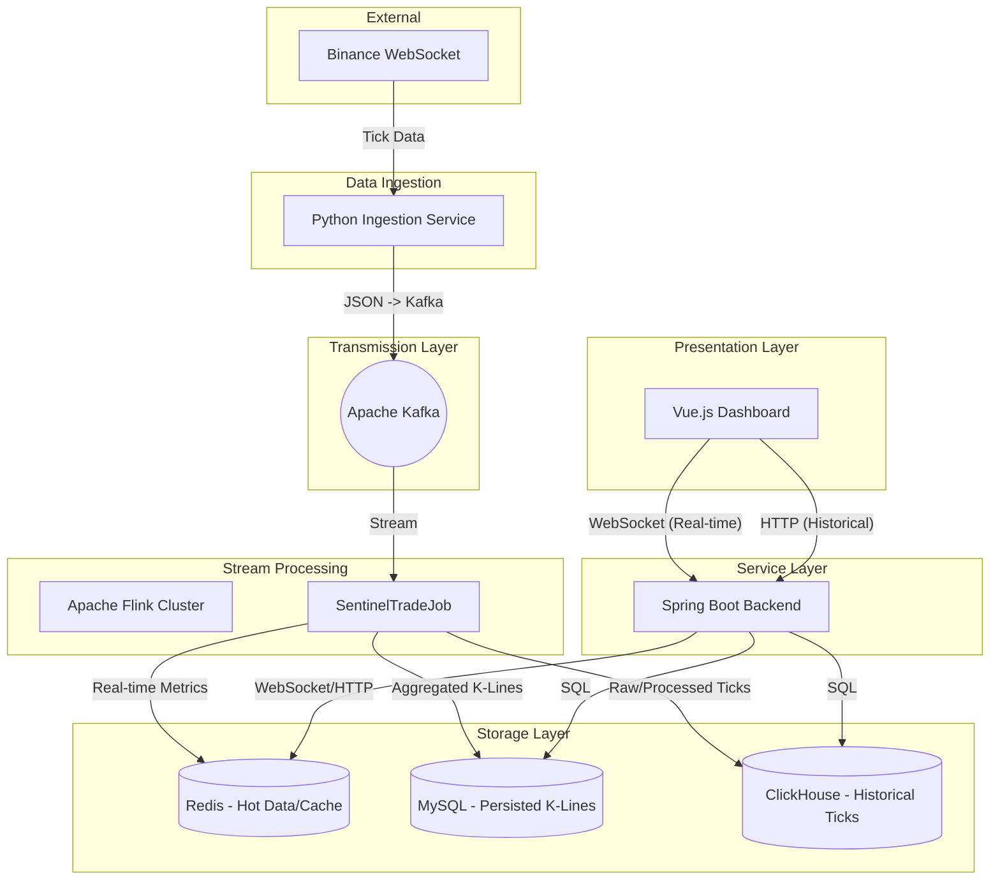

# Sentinel-Trade 系统架构文档

## 1. 概述

Sentinel-Trade 是一个专注于金融数据实时监控与分析的高性能分布式平台。它能够实时采集主流交易所（如币安）的交易数据，通过流式处理引擎进行多维度指标计算（如 K 线聚合、异常交易检测），并最终通过低延迟的推送服务展示在用户看板上。

## 2. 核心架构

系统采用微服务与流式处理相结合的架构模式，从离散的 Tick 数据到最终可视化，经历了采集、传输、计算、存储和分发五个阶段。

### 2.1 架构图

## 3. 模块详解

### 3.1 Data Ingestion (数据采集)
- **技术栈**: Python 3.10, FastAPI, `websockets`, `aiokafka`
- **职责**: 
    - 维护与交易所的长连接。
    - 接收原始 JSON 数据并进行轻量级过滤。
    - 快速推送到 Kafka `raw-tick-data` 主题。
    - 提供健康检查接口。

### 3.2 Transmission Layer (传输层)
- **核心组件**: Apache Kafka (KRaft 模式)
- **职责**: 
    - 解耦数据采集与流式处理。
    - 作为数据的缓冲区，应对上游流量突发。
    - 支持多消费者（如 Flink 计算和长期归档任务）。

### 3.3 Stream Processing (流式处理)
- **技术栈**: Apache Flink 1.17, Java 17
- **职责**: 
    - **时间窗口聚合**: 实时计算 1m, 5m, 15m 等多级 K 线。
    - **异常检测**: 检测大额成交 (Large Order) 和瞬时闪崩 (Flash Crash)。
    - **多目标同步 (Sink)**:
        - **Redis**: 存储最新的实时统计值，供后端直接推送。
        - **MySQL**: 存储聚合后的标准 K 线数据（不可变）。
        - **ClickHouse**: 存储海量 Tick 数据，支持后续回测和深度分析。

### 3.4 Service Layer (后端服务)
- **技术栈**: Spring Boot 3.0, WebFlux (WebSocket Support)
- **职责**: 
    - **实时推送**: 通过 WebSocket (STOMP/SockJS) 向前端实时推送 K 线更新和预警。
    - **业务逻辑**: 处理用户偏好设置、告警订阅。
    - **数据查询**: 提供统一的 HTTP/RPC 接口，按需从 Redis、MySQL 或 ClickHouse 调取数据。

### 3.5 Presentation Layer (前端看板)
- **技术栈**: Vue 3, ECharts, Vite
- **端口信息**:
    - **Presentation Layer (Vue.js)**: Port `3000`
    - **Service Layer (Backend)**: Port `8080`
    - **Stream Processing (Flink UI)**: Port `8081`
    - **Data Persistence**: MySQL (`3307`), ClickHouse (`8123`), Redis (`6379`), Kafka (`9092`)
- **职责**: 
    - **动态可视化**: 使用 ECharts 渲染动态 K 线图。
    - **实时警报**: 弹窗和声音提示异常交易。
    - **交互查询**: 支持用户自定义时间范围和技术指标。

## 4. 数据存储策略

| 存储引擎 | 角色 | 数据结构 | 保留策略 (TTL) |
| :--- | :--- | :--- | :--- |
| **Redis** | 热数据 / 缓存 | Hash (最新的实时指标) | 60s (或滚动更新) |
| **ClickHouse**| 温数据 / 明细 | MergeTree (原始/处理后的 Tick) | 7 天 (默认配置) |
| **MySQL** | 冷数据 / 聚合 | InnoDB (聚合后的 K 线) | 永久 (支持分表) |

## 5. 伸缩性与高可用

- **采集层**: 支持通过增加 `ingestion` 容器副本并行采集（前提是 Kafka 分区数匹配）。
- **计算层**: Flink TaskManager 可根据负载动态扩容插槽 (Slots)。
- **存储层**: ClickHouse 天然支持分布式存储。
- **服务层**: Spring Boot Backend 无状态设计，支持负载均衡。
