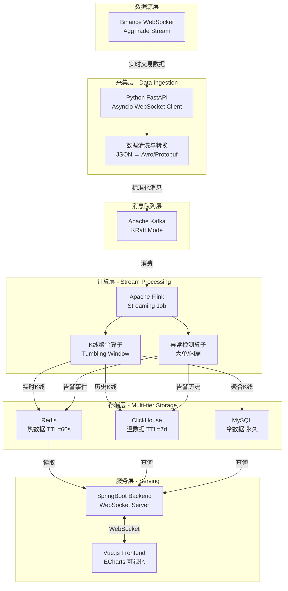

# Design Document: Sentinel-Trade

## Overview

Sentinel-Trade 是一个基于 Lambda 架构的高性能分布式实时金融数据监控与分析平台。系统采用分层设计，通过流式计算引擎处理实时数据，利用多级存储策略平衡性能与成本，最终通过 WebSocket 向前端推送实时分析结果。

核心设计目标：
- **高吞吐**：支持 20,000+ TPS 的数据处理能力
- **低延迟**：端到端延迟 < 200ms
- **资源可控**：内存 < 12GB，磁盘 < 500GB（通过 TTL 自动清理）
- **高可用**：自动重连、容错处理、数据一致性保证

## Architecture

系统采用经典的 Lambda 架构，分为速度层（Speed Layer）和批处理层（Batch Layer），并通过服务层（Serving Layer）统一对外提供服务。

### 整体架构图



### 数据流向

1. **采集阶段**：Python 客户端通过 WebSocket 连接币安交易所，接收 AggTrade 数据流
2. **转换阶段**：将 JSON 格式转换为 Avro/Protobuf 压缩格式，减少 40%+ 体积
3. **缓冲阶段**：推送到 Kafka 主题，解耦生产者和消费者
4. **计算阶段**：Flink 消费 Kafka 数据，执行窗口聚合和实时检测
5. **存储阶段**：根据数据特性分别存储到 Redis（热）、ClickHouse（温）、MySQL（冷）
6. **服务阶段**：SpringBoot 从存储层读取数据，通过 WebSocket 推送给前端

## Components and Interfaces

### 1. Data Ingestion Module (数据采集模块)

**职责**：从交易所采集实时数据，转换格式，推送到 Kafka

**技术栈**：Python 3.10+, FastAPI, asyncio, websockets, avro-python3

**核心组件**：

#### 1.1 WebSocketClient
```python
class WebSocketClient:
    """异步 WebSocket 客户端，负责连接交易所"""
    
    async def connect(url: str, on_message: Callable) -> None:
        """建立 WebSocket 连接并注册消息回调"""
        
    async def reconnect(max_retries: int = 5, backoff: float = 2.0) -> None:
        """断线重连逻辑，指数退避"""
        
    async def close() -> None:
        """优雅关闭连接"""
```

#### 1.2 DataTransformer
```python
class DataTransformer:
    """数据转换器，将原始 JSON 转换为标准格式"""
    
    def transform_aggtrade(raw_json: dict) -> TickData:
        """转换币安 AggTrade 格式"""
        
    def serialize_avro(tick_data: TickData) -> bytes:
        """序列化为 Avro 格式"""
        
    def serialize_protobuf(tick_data: TickData) -> bytes:
        """序列化为 Protobuf 格式"""
```

#### 1.3 KafkaProducer
```python
class KafkaProducer:
    """Kafka 生产者，推送标准化消息"""
    
    async def send(topic: str, key: str, value: bytes) -> None:
        """异步发送消息到 Kafka"""
        
    async def flush() -> None:
        """刷新缓冲区"""
```

**接口定义**：

```python
# 标准化 Tick 数据结构
@dataclass
class TickData:
    symbol: str          # 交易对，如 "BTCUSDT"
    price: Decimal       # 成交价格
    quantity: Decimal    # 成交数量
    timestamp: int       # 时间戳（毫秒）
    trade_id: str        # 交易 ID（用于去重）
    is_buyer_maker: bool # 是否为买方挂单
```

**配置参数**：
- Kafka Topic: `raw-tick-data`
- 重连间隔: 5 秒
- 最大重连次数: 无限（持续重试）
- 序列化格式: Avro（默认）

---

### 2. Stream Processing Module (流式计算模块)

**职责**：实时聚合 K 线、检测异常交易

**技术栈**：Apache Flink 1.17+, Flink Table API, Flink CEP

**核心组件**：

#### 2.1 KLineAggregator (K线聚合算子)
```java
public class KLineAggregator extends ProcessWindowFunction<TickData, KLine, String, TimeWindow> {
    /**
     * 聚合窗口内的 Tick 数据为 K 线
     * @param key 交易对符号
     * @param context 窗口上下文
     * @param elements 窗口内所有 Tick 数据
     * @param out 输出 K 线结果
     */
    @Override
    public void process(String key, Context context, 
                       Iterable<TickData> elements, 
                       Collector<KLine> out) {
        // 计算 OHLC
        // Open: 窗口内第一笔价格
        // High: 窗口内最高价格
        // Low: 窗口内最低价格
        // Close: 窗口内最后一笔价格
        // Volume: 窗口内总成交量
    }
}
```

**窗口配置**：
- 1 分钟窗口：`TumblingEventTimeWindows.of(Time.minutes(1))`
- 5 分钟窗口：`TumblingEventTimeWindows.of(Time.minutes(5))`
- 1 小时窗口：`TumblingEventTimeWindows.of(Time.hours(1))`
- Watermark 延迟：3-5 秒（处理乱序数据）

#### 2.2 AnomalyDetector (异常检测算子)
```java
public class AnomalyDetector extends KeyedProcessFunction<String, TickData, Alert> {
    /**
     * 检测大单和闪崩
     */
    
    // 大单检测：单笔成交金额 > 50,000 USDT
    private void detectLargeOrder(TickData tick, Collector<Alert> out) {
        BigDecimal amount = tick.price.multiply(tick.quantity);
        if (amount.compareTo(new BigDecimal("50000")) > 0) {
            out.collect(new Alert(AlertType.LARGE_ORDER, tick));
        }
    }
    
    // 闪崩检测：10秒内价格波动 > 2%
    private void detectFlashCrash(String key, Context ctx, Collector<Alert> out) {
        // 使用状态存储 10 秒内的价格
        // 计算价格变化率
        // 超过阈值则触发告警
    }
}
```

**输出 Topic**：
- K 线数据：`kline-1m`, `kline-5m`, `kline-1h`
- 告警数据：`alerts`

---

### 3. Storage Module (存储模块)

**职责**：多级存储，自动 TTL 管理

#### 3.1 Redis (热数据层)
**用途**：存储最新的 K 线和实时价格，供前端秒级刷新

**数据结构**：
```
Key: kline:{symbol}:{interval}:latest
Value: JSON 格式的 KLine 对象
TTL: 60 秒
```

**写入逻辑**：
```java
public void writeToRedis(KLine kline) {
    String key = String.format("kline:%s:%s:latest", 
                               kline.symbol, kline.interval);
    redisTemplate.opsForValue().set(key, kline, 60, TimeUnit.SECONDS);
}
```

#### 3.2 ClickHouse (温数据层)
**用途**：存储过去 7 天的所有原始 Tick 明细

**表结构**：
```sql
CREATE TABLE tick_data (
    symbol String,
    price Decimal(18, 8),
    quantity Decimal(18, 8),
    timestamp DateTime64(3),
    trade_id String,
    is_buyer_maker UInt8
) ENGINE = MergeTree()
PARTITION BY toYYYYMMDD(timestamp)
ORDER BY (symbol, timestamp)
TTL timestamp + INTERVAL 7 DAY;
```

**TTL 机制**：ClickHouse 自动删除 7 天前的数据分区

#### 3.3 MySQL (冷数据层)
**用途**：永久存储分钟级以上的聚合 K 线

**表结构**：
```sql
CREATE TABLE kline_aggregated (
    id BIGINT AUTO_INCREMENT PRIMARY KEY,
    symbol VARCHAR(20) NOT NULL,
    interval ENUM('1m', '5m', '1h', '1d') NOT NULL,
    open_time DATETIME(3) NOT NULL,
    open_price DECIMAL(18, 8) NOT NULL,
    high_price DECIMAL(18, 8) NOT NULL,
    low_price DECIMAL(18, 8) NOT NULL,
    close_price DECIMAL(18, 8) NOT NULL,
    volume DECIMAL(18, 8) NOT NULL,
    INDEX idx_symbol_interval_time (symbol, interval, open_time)
) ENGINE=InnoDB;
```

---

### 4. Serving Module (服务模块)

**职责**：对外提供 WebSocket 推送和 HTTP 查询接口

**技术栈**：Java 17, Spring Boot 3.0, Spring WebSocket

#### 4.1 WebSocketHandler
```java
@Component
public class MarketDataWebSocketHandler extends TextWebSocketHandler {
    /**
     * 处理客户端连接，订阅实时数据推送
     */
    @Override
    public void afterConnectionEstablished(WebSocketSession session) {
        // 将 session 加入订阅列表
        // 开始推送实时 K 线和告警
    }
    
    /**
     * 从 Redis 读取最新数据并推送
     */
    @Scheduled(fixedRate = 1000) // 每秒推送一次
    public void pushLatestData() {
        // 读取 Redis 中的最新 K 线
        // 推送给所有连接的客户端
    }
}
```

#### 4.2 HistoryQueryController
```java
@RestController
@RequestMapping("/api/history")
public class HistoryQueryController {
    /**
     * 查询历史 Tick 数据
     */
    @GetMapping("/ticks")
    public List<TickData> queryTicks(
        @RequestParam String symbol,
        @RequestParam Long startTime,
        @RequestParam Long endTime
    ) {
        // 从 ClickHouse 查询
        return clickHouseRepository.queryTicks(symbol, startTime, endTime);
    }
    
    /**
     * 查询历史 K 线数据
     */
    @GetMapping("/klines")
    public List<KLine> queryKLines(
        @RequestParam String symbol,
        @RequestParam String interval,
        @RequestParam Long startTime,
        @RequestParam Long endTime
    ) {
        // 从 MySQL 查询
        return mysqlRepository.queryKLines(symbol, interval, startTime, endTime);
    }
}
```

---

## Data Models

### TickData (Tick 数据)
```python
{
    "symbol": "BTCUSDT",
    "price": "45123.56",
    "quantity": "0.125",
    "timestamp": 1704067200000,
    "trade_id": "12345678",
    "is_buyer_maker": false
}
```

### KLine (K线数据)
```json
{
    "symbol": "BTCUSDT",
    "interval": "1m",
    "open_time": 1704067200000,
    "close_time": 1704067259999,
    "open": "45123.56",
    "high": "45200.00",
    "low": "45100.00",
    "close": "45180.23",
    "volume": "12.345",
    "trade_count": 156
}
```

### Alert (告警数据)
```json
{
    "alert_id": "uuid-string",
    "alert_type": "LARGE_ORDER",
    "symbol": "BTCUSDT",
    "timestamp": 1704067200000,
    "severity": "HIGH",
    "details": {
        "price": "45123.56",
        "quantity": "1.5",
        "amount": "67685.34"
    }
}
```

---

## Properties

### Property 1: 数据转换保持完整性

### Property 2: 转换后的数据成功发布到 Kafka

### Property 3: 断线后自动重连

### Property 4: K线聚合产生所有时间间隔

### Property 5: OHLC 计算正确性

### Property 6: Watermark 处理乱序数据

### Property 7: 大单检测阈值准确性

### Property 8: 闪崩检测准确性

### Property 9: 告警包含完整信息

### Property 10: 数据正确路由到存储层

### Property 11: WebSocket 连接建立后开始推送

### Property 12: 查询结果格式正确

### Property 13: 序列化格式正确

### Property 14: 序列化往返一致性（Round-trip）

### Property 15: 关键事件日志完整性

### Property 16: 去重防止重复计数

### Property 17: 跨存储层数据一致性

---

## Error Handling

### 1. 连接错误处理
- **WebSocket 断线**：指数退避重连（初始 5 秒，最大 60 秒）
- **Kafka 连接失败**：记录错误日志，重试连接，超过 10 次失败后告警
- **数据库连接失败**：使用连接池自动重连，记录错误日志

### 2. 数据错误处理
- **无效 JSON 格式**：记录原始数据到错误日志，跳过该消息，继续处理
- **缺失必填字段**：记录警告日志，使用默认值或跳过
- **数值溢出**：使用 Decimal 类型防止精度丢失，超出范围则记录错误

### 3. 计算错误处理
- **空窗口**：如果时间窗口内无数据，不生成 K 线，记录调试日志
- **乱序数据超出 Watermark**：丢弃过晚数据，记录警告日志（包含 trade_id 和延迟时间）
- **重复消息**：基于 trade_id 去重，记录调试日志

### 4. 存储错误处理
- **Redis 写入失败**：记录错误日志，不阻塞主流程（热数据可丢失）
- **ClickHouse 写入失败**：重试 3 次，失败后记录到死信队列
- **MySQL 写入失败**：重试 3 次，失败后告警（冷数据不可丢失）

### 5. 资源限制处理
- **内存接近上限**：触发 GC，记录警告日志，考虑降低缓存大小
- **磁盘接近上限**：提前触发 TTL 清理，记录告警日志
- **Kafka 消费延迟过高**：记录告警日志，考虑扩容消费者

---

## Testing Strategy

### 单元测试（Unit Tests）

单元测试用于验证特定示例、边界情况和错误条件：

**数据转换模块**：
- 测试标准 JSON 转换为 Avro/Protobuf
- 测试缺失字段的处理
- 测试无效数值的处理
- 测试边界值（极大/极小价格和数量）

**K线聚合模块**：
- 测试单笔交易的窗口聚合
- 测试空窗口的处理
- 测试窗口边界的交易归属

**异常检测模块**：
- 测试恰好 50,000 USDT 的边界情况
- 测试恰好 2% 的价格变化
- 测试空数据流的处理

**存储模块**：
- 测试 Redis TTL 设置
- 测试 ClickHouse 分区创建
- 测试 MySQL 事务提交

### 属性测试（Property-Based Tests）

属性测试用于验证跨所有输入的通用属性，每个测试运行至少 100 次迭代：

**配置**：
- 使用 Hypothesis（Python）或 QuickCheck（Java/Scala）
- 每个属性测试最少 100 次迭代
- 每个测试必须引用设计文档中的属性编号

**标签格式**：
```
Feature: sentinel-trade, Property 5: OHLC 计算正确性
```

**测试覆盖**：
- Property 1-17：每个属性对应一个独立的属性测试
- 生成随机 TickData 序列（不同价格、数量、时间戳）
- 生成随机窗口大小和 Watermark 延迟
- 生成随机连接中断场景
- 生成随机重复和乱序数据

**示例属性测试（伪代码）**：
```python
@given(tick_sequence=st.lists(st.builds(TickData)))
def test_ohlc_correctness(tick_sequence):
    """
    Feature: sentinel-trade, Property 5: OHLC 计算正确性
    """
    if not tick_sequence:
        return  # 空序列跳过
    
    kline = aggregate_to_kline(tick_sequence)
    
    assert kline.open == tick_sequence[0].price
    assert kline.high == max(t.price for t in tick_sequence)
    assert kline.low == min(t.price for t in tick_sequence)
    assert kline.close == tick_sequence[-1].price
    assert kline.volume == sum(t.quantity for t in tick_sequence)
```

### 集成测试（Integration Tests）

- 端到端测试：从 WebSocket 接收到前端推送的完整流程
- 使用 Testcontainers 启动 Kafka、Redis、ClickHouse、MySQL
- 验证数据在各层之间的正确流转
- 测试系统在组件故障时的恢复能力

### 性能测试（Performance Tests）

- 吞吐量测试：使用 JMeter 或 Gatling 模拟 20,000 TPS 负载
- 延迟测试：测量端到端延迟（目标 < 200ms）
- 资源监控：使用 Prometheus + Grafana 监控内存和磁盘使用
- 压力测试：逐步增加负载直到系统达到瓶颈

---

## Deployment Architecture

### Docker Compose 配置

```yaml
version: '3.8'

services:
  # Kafka (KRaft mode, single node)
  kafka:
    image: apache/kafka:3.6.0
    container_name: sentinel-kafka
    ports:
      - "9092:9092"
    environment:
      KAFKA_NODE_ID: 1
      KAFKA_PROCESS_ROLES: broker,controller
      KAFKA_LISTENERS: PLAINTEXT://0.0.0.0:9092
      KAFKA_LOG_RETENTION_HOURS: 24
    mem_limit: 2g
    volumes:
      - kafka-data:/var/lib/kafka/data

  # Redis
  redis:
    image: redis:7-alpine
    container_name: sentinel-redis
    ports:
      - "6379:6379"
    command: redis-server --maxmemory 1gb --maxmemory-policy allkeys-lru
    mem_limit: 1g

  # ClickHouse
  clickhouse:
    image: clickhouse/clickhouse-server:23.8
    container_name: sentinel-clickhouse
    ports:
      - "8123:8123"
      - "9000:9000"
    mem_limit: 4g
    volumes:
      - clickhouse-data:/var/lib/clickhouse

  # MySQL
  mysql:
    image: mysql:8.0
    container_name: sentinel-mysql
    ports:
      - "3306:3306"
    environment:
      MYSQL_ROOT_PASSWORD: sentinel123
      MYSQL_DATABASE: sentinel_trade
    mem_limit: 2g
    volumes:
      - mysql-data:/var/lib/mysql

  # Data Ingestion (Python)
  ingestion:
    build: ./ingestion
    container_name: sentinel-ingestion
    depends_on:
      - kafka
    environment:
      KAFKA_BOOTSTRAP_SERVERS: kafka:9092
      BINANCE_WS_URL: wss://stream.binance.com:9443/ws/btcusdt@aggTrade
    mem_limit: 512m

  # Stream Processing (Flink)
  flink-jobmanager:
    image: flink:1.17
    container_name: sentinel-flink-jm
    ports:
      - "8081:8081"
    command: jobmanager
    environment:
      FLINK_PROPERTIES: "jobmanager.rpc.address: flink-jobmanager"
    mem_limit: 1g

  flink-taskmanager:
    image: flink:1.17
    container_name: sentinel-flink-tm
    depends_on:
      - flink-jobmanager
    command: taskmanager
    environment:
      FLINK_PROPERTIES: "jobmanager.rpc.address: flink-jobmanager"
    mem_limit: 2g

  # Backend Service (Spring Boot)
  backend:
    build: ./backend
    container_name: sentinel-backend
    ports:
      - "8080:8080"
    depends_on:
      - redis
      - clickhouse
      - mysql
    environment:
      SPRING_REDIS_HOST: redis
      SPRING_DATASOURCE_URL: jdbc:mysql://mysql:3306/sentinel_trade
      CLICKHOUSE_URL: http://clickhouse:8123
    mem_limit: 1g

volumes:
  kafka-data:
  clickhouse-data:
  mysql-data:
```

**总内存分配**：2g + 1g + 4g + 2g + 0.5g + 1g + 2g + 1g = 13.5g（略超 12GB，可调整 ClickHouse 为 3g）

---

## Implementation Notes

### 技术选型理由

1. **Python + FastAPI**：异步 I/O 性能优秀，适合 WebSocket 长连接
2. **Kafka KRaft**：无需 ZooKeeper，简化部署，单节点足够支撑 20k TPS
3. **Apache Flink**：成熟的流处理引擎，原生支持事件时间和 Watermark
4. **Redis**：内存数据库，亚毫秒级读写，适合热数据缓存
5. **ClickHouse**：列式存储，OLAP 查询性能优秀，原生支持 TTL
6. **MySQL**：成熟稳定，适合存储结构化的聚合数据

### 性能优化建议

1. **批量写入**：Kafka Producer 使用批量发送（batch.size=16KB）
2. **异步处理**：所有 I/O 操作使用异步模式，避免阻塞
3. **连接池**：数据库连接使用连接池（HikariCP），复用连接
4. **索引优化**：ClickHouse 和 MySQL 在时间戳和交易对字段上建立索引
5. **压缩**：Kafka 启用 LZ4 压缩，ClickHouse 使用 ZSTD 压缩

### 监控指标

- **吞吐量**：每秒处理的 Tick 数量
- **延迟**：P50、P95、P99 延迟
- **错误率**：每分钟错误数量
- **资源使用**：CPU、内存、磁盘、网络
- **Kafka Lag**：消费者延迟
- **告警数量**：每分钟触发的告警数量
