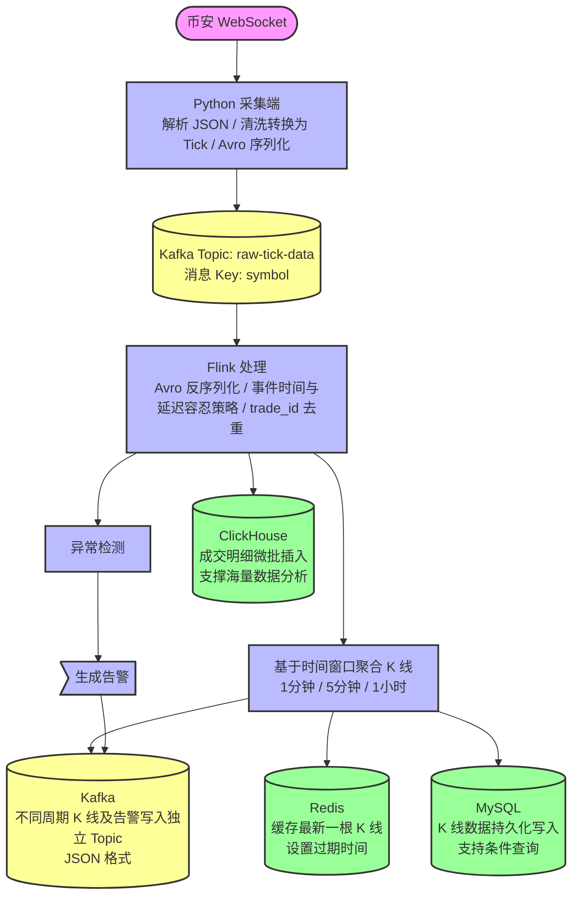

# Sentinel-Trade 项目报告 
**项目成员**：40240223 陈为、16230823 季楷昊、20240708 李涛君、40240208 张泽壑、40240216 梁贺禹 
代码仓库：[https://github.com/cw-jlu/Sentinel-trade/tree/main](https://github.com/cw-jlu/Sentinel-trade/tree/main) 
--- 
## 一、项目功能与数据处理对象 
### 1.1 项目概述 
本项目实现了一套**实时加密货币成交监控、K 线聚合计算及异常告警**系统。核心处理流程为：通过程序与 **Binance（币安）** 的 **WebSocket** 建立长连接以实时接收成交推送；接收到的 JSON 数据在 **Python 采集端**进行清洗与格式化，随后使用 **Avro**（一种带 schema 的二进制格式，具备高压缩比与强类型定义）进行序列化，并写入 **Kafka**（消息队列，实现数据缓冲与系统解耦）。进而，**Flink**（流式计算框架）从 Kafka 消费原始成交数据，**基于 trade_id 去重**，按分钟 / 5 分钟 / 小时窗口聚合 **K 线**，并同步执行**异常检测**；计算结果分别输出至 **Kafka**（供下游系统订阅）、**Redis**（缓存最新 K 线供前端查询）、**ClickHouse**（存储海量成交明细）以及 **MySQL**（持久化 K 线历史数据）。 
### 1.2 数据格式与定义 
| 项目 | 说明 | 
| -------- | ----------------------------------------------------------------------------- | 
| **数据来源** | 币安 `aggTrade` 流，默认 `BTCUSDT`，可通过环境变量配置其他交易对 | 
| **原始数据** | JSON 格式字符串，字段采用缩写形式，例如 `s` 代表交易对、`p` 代表价格、`q` 代表数量、`T` 代表时间戳、`a` 代表成交编号、`m` 代表是否为买方挂单成交等 | 
| **标准化数据** | 系统内定义为 **Tick** 数据结构，包含：交易对、价格、数量、时间戳、唯一的 `trade_id` 及 `is_buyer_maker` 等后续分析所需字段 | 
| **衍生指标** | **名义成交额**：**amount = price × quantity**，用于后续大单规则判定；价格与数量计算均采用高精度小数，单位默认为 **USDT** 等报价币种。 | 
--- 
## 二、端到端数据流转架构 
以下架构图依据仓库内 `**ingestion/`**（采集模块）与 `**stream-processing/**`（Flink 计算模块）的实际处理链路绘制，便于后续章节对照参考： 

--- 
## 三、数据采集与 Kafka 写入机制 
在采集服务中，每条校验通过的 Tick 数据经 `serialize_avro` 序列化为字节数组后推送至 Kafka。Topic 默认命名为 `**raw-tick-data**`，需与 Flink 消费端配置保持一致。消息的 **Key** 设为 `**symbol`（交易对）**，确保同一交易对的数据路由至同一 Kafka 分区，与 Flink 端的 `keyBy(交易对)` 逻辑对应。 
```python 
# ingestion/main.py 
KAFKA_TOPIC: str = os.getenv("KAFKA_TOPIC", "raw-tick-data") 
# ... 
avro_bytes = serialize_avro(tick) 
await self._producer.send(KAFKA_TOPIC, key=tick.symbol, value=avro_bytes) 
``` 
```python 
# ingestion/kafka_producer.py 
await self._producer.send( 
    topic, 
    key=key.encode("utf-8"), 
    value=value, 
) 
``` 
--- 
## 四、Flink 核心计算逻辑与代码实现 
### 4.1 代码执行流程解析 
参照 `SentinelTradeJob.java` 的代码结构，核心处理流程如下： 
1. **Kafka 数据源消费**：通过 `KafkaSource` 订阅 `raw-tick-data` 主题，使用自定义的 `TickDataAvroDeserializer` 将二进制数据反序列化为 Java 对象。 
2. **时间特征与水位线提取**：配置 Flink 的 `WatermarkStrategy`，允许处理一定程度的乱序数据（默认容忍 5 秒延迟），时间戳提取自每条成交数据的 `getTimestamp()`。 
3. **数据去重**：按 `symbol` 分组后流入 `DeduplicationFilter`，基于 `trade_id` 过滤重复记录。 
4. **K 线聚合**：在去重后的数据流上，分别划分 1 分钟、5 分钟、1 小时的滚动窗口，并调用 `KLineAggregator` 聚合生成 K 线数据。 
5. **异常检测**：去重后的数据流按 `symbol` 分组输入 `AnomalyDetector`，生成告警信息。 
6. **数据下发**：三周期 K 线分别通过 `sinkTo` 写入对应 Kafka Topic（值采用 JSON 序列化），同时通过 `addSink` 写入 Redis 与 MySQL；去重后的逐笔成交流（`dedupedStream`）则通过 `ClickHouseSink` 写入 ClickHouse。 
### 4.2 核心代码实现（`SentinelTradeJob` 管道构建） 
```java 
// stream-processing/src/main/java/com/sentinel_trade/SentinelTradeJob.java 
env.enableCheckpointing(30_000); 
env.setParallelism(1); 
KafkaSource<TickData> kafkaSource = KafkaSource.<TickData>builder() 
    .setBootstrapServers(KAFKA_BROKERS) 
    .setTopics(SOURCE_TOPIC) 
    .setGroupId("sentinel-flink-consumer") 
    .setStartingOffsets(OffsetsInitializer.latest()) 
    .setValueOnlyDeserializer(new TickDataAvroDeserializer()) 
    .build(); 
WatermarkStrategy<TickData> watermarkStrategy = WatermarkStrategy 
    .<TickData>forBoundedOutOfOrderness(WATERMARK_DELAY) 
    .withTimestampAssigner((tick, recordTimestamp) -> tick.getTimestamp()); 
DataStream<TickData> rawStream = env 
    .fromSource(kafkaSource, watermarkStrategy, "Kafka Source: raw-tick-data"); 
SingleOutputStreamOperator<TickData> dedupedStream = rawStream 
    .keyBy(TickData::getSymbol) 
    .process(new DeduplicationFilter()) 
    .name("Deduplication Filter"); 
DataStream<KLine> kline1m = dedupedStream 
    .keyBy(TickData::getSymbol) 
    .window(TumblingEventTimeWindows.of(Time.minutes(1))) 
    .process(new KLineAggregator("1m")) 
    .name("KLine Aggregator 1m"); 
DataStream<KLine> kline5m = dedupedStream 
    .keyBy(TickData::getSymbol) 
    .window(TumblingEventTimeWindows.of(Time.minutes(5))) 
    .process(new KLineAggregator("5m")) 
    .name("KLine Aggregator 5m"); 
DataStream<KLine> kline1h = dedupedStream 
    .keyBy(TickData::getSymbol) 
    .window(TumblingEventTimeWindows.of(Time.hours(1))) 
    .process(new KLineAggregator("1h")) 
    .name("KLine Aggregator 1h"); 
DataStream<Alert> alerts = dedupedStream 
    .keyBy(TickData::getSymbol) 
    .process(new AnomalyDetector()) 
    .name("Anomaly Detector"); 
String mysqlUrl = System.getenv().getOrDefault("MYSQL_URL", "jdbc:mysql://mysql:3306/sentinel_trade?useSSL=false"); 
String mysqlUser = System.getenv().getOrDefault("MYSQL_USER", "root"); 
String mysqlPass = System.getenv().getOrDefault("MYSQL_PASSWORD", "sentinel123"); 
String clickhouseUrl = System.getenv().getOrDefault("CLICKHOUSE_JDBC_URL", "jdbc:clickhouse://clickhouse:8123/sentinel_trade"); 
String redisHost = System.getenv().getOrDefault("REDIS_HOST", "redis"); 
int redisPort = Integer.parseInt(System.getenv().getOrDefault("REDIS_PORT", "6379")); 
kline1m.sinkTo(buildKafkaSink(TOPIC_KLINE_1M)).name("Sink: kline-1m (Kafka)"); 
kline5m.sinkTo(buildKafkaSink(TOPIC_KLINE_5M)).name("Sink: kline-5m (Kafka)"); 
kline1h.sinkTo(buildKafkaSink(TOPIC_KLINE_1H)).name("Sink: kline-1h (Kafka)"); 
alerts.sinkTo(buildKafkaSink(TOPIC_ALERTS)).name("Sink: alerts (Kafka)"); 
kline1m.addSink(new com.sentinel_trade.sink.RedisSink(redisHost, redisPort)).name("Sink: kline-1m (Redis)"); 
kline5m.addSink(new com.sentinel_trade.sink.RedisSink(redisHost, redisPort)).name("Sink: kline-5m (Redis)"); 
kline1h.addSink(new com.sentinel_trade.sink.RedisSink(redisHost, redisPort)).name("Sink: kline-1h (Redis)"); 
kline1m.addSink(new com.sentinel_trade.sink.MySQLSink(mysqlUrl, mysqlUser, mysqlPass)).name("Sink: kline-1m (MySQL)"); 
kline5m.addSink(new com.sentinel_trade.sink.MySQLSink(mysqlUrl, mysqlUser, mysqlPass)).name("Sink: kline-5m (MySQL)"); 
kline1h.addSink(new com.sentinel_trade.sink.MySQLSink(mysqlUrl, mysqlUser, mysqlPass)).name("Sink: kline-1h (MySQL)"); 
dedupedStream.addSink(new com.sentinel_trade.sink.ClickHouseSink(clickhouseUrl)).name("Sink: tick-data (ClickHouse)"); 
LOG.info("Sentinel-Trade pipeline built – brokers={}", KAFKA_BROKERS); 
return env; 
} 
``` 
K 线与告警数据写入 Kafka 时，采用以下辅助方法构建 Sink：**传入目标 Topic 名称**，**值采用 JSON 序列化**。 
```java 
private static <T> KafkaSink<T> buildKafkaSink(String topic) { 
    return KafkaSink.<T>builder() 
        .setBootstrapServers(KAFKA_BROKERS) 
        .setRecordSerializer( 
            KafkaRecordSerializationSchema.<T>builder() 
                .setTopic(topic) 
                .setValueSerializationSchema(new JsonSerializationSchema<T>()) 
                .build() 
        ) 
        .build(); 
} 
``` 
--- 
## 五、多数据存储引擎的写入实现 
本节重点阐述各存储引擎的**写入机制与配置**，避免与 Flink 算子构建逻辑重复。涉及的 JDBC 为 Java 数据库连接标准规范。 
### 5.1 Redis：最新周期 K 线缓存与 TTL 策略 
```java 
// stream-processing/.../sink/RedisSink.java 
private static final int TTL_SECONDS = 60; 
@Override 
public void invoke(KLine kline, Context context) { 
    String key = String.format("kline:%s:%s:latest", kline.getSymbol(), kline.getInterval()); 
    try (Jedis jedis = jedisPool.getResource()) { 
        String json = MAPPER.writeValueAsString(kline); 
        jedis.setex(key, TTL_SECONDS, json); 
    } catch (Exception e) { 
        LOG.error("RedisSink failed to write key={}: {}", key, e.getMessage()); 
    } 
} 
``` 
**设计说明**：缓存键名包含交易对与周期维度，值为完整 K 线的 JSON 数据；通过 `setex` 指令设定 **60 秒过期时间**，满足前端仅获取最新 K 线的查询需求。写入异常时仅记录日志，不中断 Flink 处理管道。 
### 5.2 ClickHouse：交易明细微批写入机制 
```java 
// stream-processing/.../sink/ClickHouseSink.java 
private static final int BATCH_SIZE = 1000; 
private static final String INSERT_SQL = "INSERT INTO sentinel_trade.tick_data " 
    + "(symbol, price, quantity, timestamp, trade_id, is_buyer_maker) VALUES (?,?,?,?,?,?)"; 
@Override 
public void invoke(TickData tick, Context context) throws Exception { 
    buffer.add(tick); 
    if (buffer.size() >= BATCH_SIZE) { 
        flush(); 
    } 
} 
private void flush() throws Exception { 
    if (buffer.isEmpty()) return; 
    for (TickData tick : buffer) { 
        statement.setString(1, tick.getSymbol()); 
        statement.setBigDecimal(2, tick.getPrice()); 
        statement.setBigDecimal(3, tick.getQuantity()); 
        statement.setTimestamp(4, new Timestamp(tick.getTimestamp())); 
        statement.setString(5, tick.getTradeId()); 
        statement.setInt(6, tick.isBuyerMaker() ? 1 : 0); 
        statement.addBatch(); 
    } 
    statement.executeBatch(); 
    buffer.clear(); 
} 
``` 
**设计说明**：数据先缓存至内存 `buffer`，累积至 **1000 条**后触发 `executeBatch` 批量提交，显著降低网络开销。字段 `is_buyer_maker` 在表结构中映射为 **0/1** 整型存储。 
### 5.3 MySQL：K 线数据 Upsert 写入策略 
以下 SQL 采用 `**ON DUPLICATE KEY UPDATE`** 语法：当插入记录触发主键或唯一键冲突时，将执行后续的 UPDATE 语句更新 OHLCV 等字段，而非重新插入。 
**注意**：若仓库初始化脚本 `01_init.sql` 未针对 `symbol`、`interval`、`open_time` 建立唯一约束，该语法将退化为普通 `INSERT`。上线前需校验表结构约束，以确保去重更新逻辑生效。 
```java 
// stream-processing/.../sink/MySQLSink.java 
private static final String INSERT_SQL = "INSERT INTO kline_aggregated " 
    + "(symbol, `interval`, open_time, open_price, high_price, low_price, close_price, volume, trade_count) " 
    + "VALUES (?,?,?,?,?,?,?,?,?) " 
    + "ON DUPLICATE KEY UPDATE " 
    + "open_price=VALUES(open_price), high_price=VALUES(high_price), " 
    + "low_price=VALUES(low_price), close_price=VALUES(close_price), " 
    + "volume=VALUES(volume), trade_count=VALUES(trade_count)"; 
@Override 
public void invoke(KLine kline, Context context) throws Exception { 
    statement.setString(1, kline.getSymbol()); 
    statement.setString(2, kline.getInterval()); 
    statement.setTimestamp(3, new Timestamp(kline.getOpenTime())); 
    statement.setBigDecimal(4, kline.getOpen()); 
    statement.setBigDecimal(5, kline.getHigh()); 
    statement.setBigDecimal(6, kline.getLow()); 
    statement.setBigDecimal(7, kline.getClose()); 
    statement.setBigDecimal(8, kline.getVolume()); 
    statement.setInt(9, kline.getTradeCount()); 
    statement.executeUpdate(); 
} 
``` 
### 5.4 数据库表结构定义（DDL） 
以下为项目初始化脚本 `**init/clickhouse/01_init.sql**` 与 `**init/mysql/01_init.sql**` 内容，字段定义与顺序与 Java 层 INSERT 语句严格对应，以避免运行时映射异常。 
```sql 
-- init/clickhouse/01_init.sql 
CREATE TABLE IF NOT EXISTS sentinel_trade.tick_data ( 
    symbol String, 
    price Decimal(18, 8), 
    quantity Decimal(18, 8), 
    timestamp DateTime64(3), 
    trade_id String, 
    is_buyer_maker UInt8 
) ENGINE = MergeTree() 
PARTITION BY toYYYYMMDD(timestamp) 
ORDER BY (symbol, timestamp) 
TTL toDateTime(timestamp) + INTERVAL 7 DAY 
SETTINGS index_granularity = 8192; 
``` 
```sql 
-- init/mysql/01_init.sql 
CREATE TABLE IF NOT EXISTS kline_aggregated ( 
    id BIGINT AUTO_INCREMENT PRIMARY KEY, 
    symbol VARCHAR(20) NOT NULL, 
    `interval` ENUM('1m', '5m', '1h', '1d') NOT NULL, 
    open_time DATETIME(3) NOT NULL, 
    open_price DECIMAL(18, 8) NOT NULL, 
    high_price DECIMAL(18, 8) NOT NULL, 
    low_price DECIMAL(18, 8) NOT NULL, 
    close_price DECIMAL(18, 8) NOT NULL, 
    volume DECIMAL(18, 8) NOT NULL, 
    trade_count INT UNSIGNED NOT NULL DEFAULT 0, 
    INDEX idx_symbol_interval_time (symbol, `interval`, open_time) 
) ENGINE = InnoDB DEFAULT CHARSET = utf8mb4; 
``` 
--- 
## 六、总结 
1. **架构总结**：第二节描绘了从币安数据源、Kafka 消息队列、Flink 计算引擎到多种数据库的**端到端数据链路**；第三节阐述了**数据接入与 Kafka 写入机制**；第四节说明了 **Flink 的核心计算逻辑与 Kafka 输出**；第五节详述了 **Redis / ClickHouse / MySQL 的写入策略与表结构**。 
2. **存储选型**：Redis 适用于前端最新 K 线的低延迟获取；ClickHouse 适用于海量成交明细的 OLAP 分析；MySQL 中的 K 线表适用于基于交易对、周期及时间维度的结构化历史查询。 
3. **Kafka 角色定位**：Kafka 在架构中出现两次，分别承担原始成交数据的输入缓冲与计算结果的输出分发，实现了系统间的解耦与故障隔离。 
--- 
## 七、参考文献 
- 币安 WebSocket 文档：[https://binance-docs.github.io/apidocs/spot/cn/](https://binance-docs.github.io/apidocs/spot/cn/) 
- 本仓库设计文档：`docs/architecture.md`、`docs/design.md` 
- Kafka、Flink、Redis、ClickHouse、MySQL 官方技术文档
```
